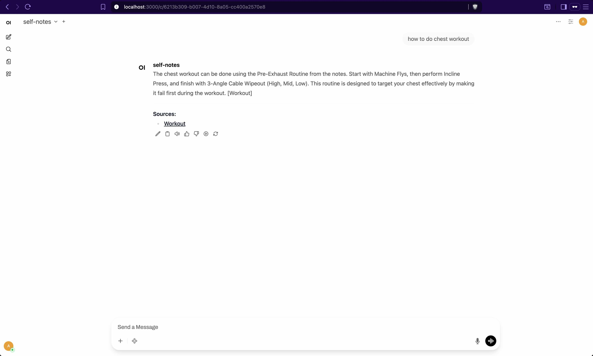

# self-notes

Local RAG system for querying Notion workspaces. Runs entirely on your machine using Ollama.

## Requirements

- Python 3.10+
- [Ollama](https://ollama.com)

## Setup

### Ollama Service management:

```bash
brew services start ollama    # Start
brew services stop ollama     # Stop
brew services restart ollama  # Restart
brew services list            # Check status
```

### Ollama Pull Models

```bash
ollama pull mistral
ollama pull nomic-embed-text
```

### Python

```bash
# Create and activate venv
python3 -m venv .venv
source .venv/bin/activate  # Windows: .venv\Scripts\activate

# Install dependencies
pip install -r requirements.txt

# Configure
cp .env.example .env
# Add NOTION_API_KEY to .env
```

### Notion Integration

1. Create integration at https://notion.so/my-integrations
2. Copy the internal integration token to `.env`
3. Share target pages with the integration (page menu → Connections → add integration)
4. Add page URLs to `ROOT_PAGES` in `src/config.py`

## Usage

### CLI

```bash
python cli.py index                     # Sync and index from Notion
python cli.py ask "your question"       # Query indexed content
python cli.py sources                   # List indexed pages
```

### API Server (for Open WebUI)

Start the OpenAI-compatible API server:

```bash
python api.py
```

The server runs at `http://localhost:8000`.

**Run Open WebUI in Docker:**

```bash
docker run -d \
  -p 3000:8080 \
  -v open-webui:/app/backend/data \
  --name open-webui \
  --add-host=host.docker.internal:host-gateway \
  ghcr.io/open-webui/open-webui:main
```

Open WebUI will be available at `http://localhost:3000`.

**Connect to self-notes:**

1. Setup Admin Account (if first time)
2. Go to Admin Panel → Settings → Connections
3. Add a new OpenAI-compatible connection:
   - URL: `http://host.docker.internal:8000/v1`
   - API Key: `any-value` (not validated)
4. Select the `self-notes` model in your chat



## Architecture

```
Notion API → fetch pages (recursive) → chunk → embed (Ollama) → numpy vector store
                                                                       ↓
Question → embed → cosine similarity search → context + prompt → Ollama → answer
```

## Configuration

`src/config.py`:

| Variable | Description |
|----------|-------------|
| `ROOT_PAGES` | List of Notion page URLs/IDs to index (includes children recursively) |
| `EMBEDDING_MODEL` | Ollama model for embeddings (default: `nomic-embed-text`) |
| `LLM_MODEL` | Ollama model for generation (default: `mistral`) |
| `CHUNK_SIZE` | Text chunk size in chars (default: 500) |
| `CHUNK_OVERLAP` | Overlap between chunks (default: 50) |
| `TOP_K_RESULTS` | Number of chunks to retrieve per query (default: 4) |

## Project Structure

```
src/
├── config.py       # Configuration
├── notion.py       # Notion API client, recursive page fetching
├── indexer.py      # Chunking, embedding, storage
├── query.py        # Retrieval and LLM generation
└── vectorstore.py  # Simple numpy-based vector store
cli.py              # CLI entrypoint
db/                 # Vector store data (gitignored)
```

## Notes

- Only pages shared with your integration are accessible
- Child pages are fetched recursively from each root page
- Re-running `index` clears and rebuilds the entire index
- All data stays local except Notion API calls to fetch content
- Uses numpy for vector similarity - no external DB dependencies
